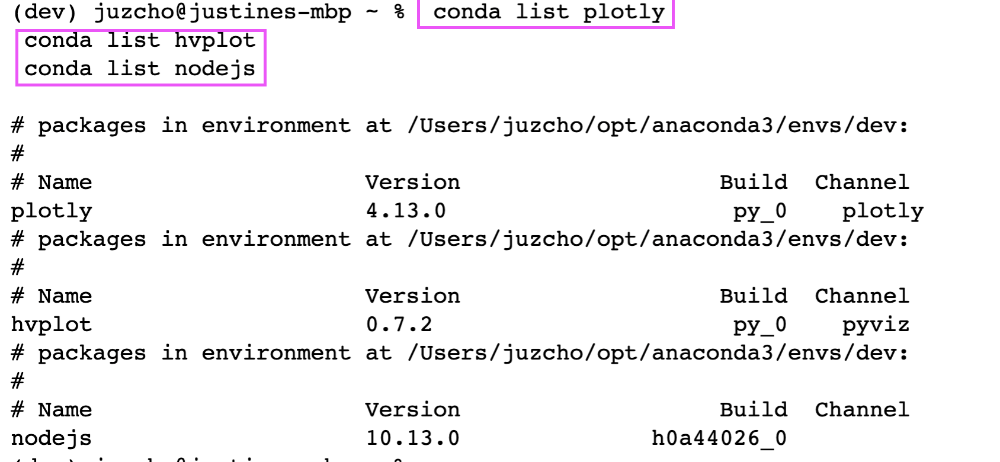
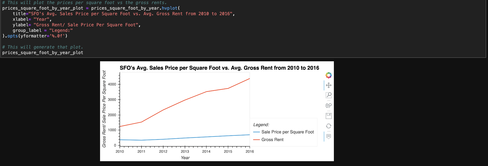
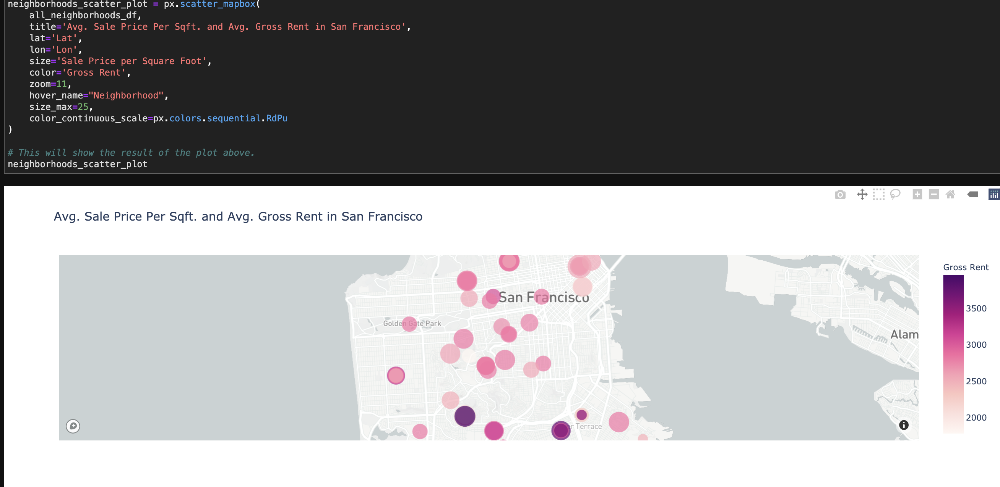

# **Module 6 Challenge: Proptech Housing Rental Analysis**

## Proptech Housing Rental Analysis

The Proptech tool is about evaluating the different San Francisco neighborhoods and understanding which neighborhood would be a good investment over time that will be good to buy and then rent the properties afterwards. 

---

## Technologies

This project leverages **[python version 3.8.5](https://www.python.org/downloads/)** with the following packages and modules:

* [pandas](https://pandas.pydata.org/docs/) - This was used to be able to easily manipulate dataframes.

* [Jupyter Lab](https://jupyterlab.readthedocs.io/en/stable/) - This was used to be able to create and share documents that contain live code, equations, visualizations and narrative text.

* [PyVizlot](https://pyviz.org/) -  Python visualization package that provides a single platform for accessing multiple visualization libraries. Two of the libraries are:

    * [plotly.express](https://plotly.com/python/plotly-express/) - This was used for data visualizatio for a rapid figure generation.

    * [hvPlot](https://hvplot.holoviz.org/index.html) -  This was used to be able to have an interactive plotting tool such as a line/bar graph.

* [MAPBOX API](https://www.mapbox.com/) -  This is used to get API data for this project's data visualization. To have access to Mapbox's API key the user needs to register for an account and save their own keys.

* [OS module](https://docs.python.org/3/library/os.html) - This provides a portable way of using operating system dependent functionality.

* [python-dotenv Library](https://pypi.org/project/python-dotenv/) - This enables the user to read key-value pairs from an .env file and set them as an environment variables.

---
## Installation Guide

### 1. Installing and Running Jupyter notebook

On the terminal, under the conda dev environment, type the code below:

`pip install jupyterlab`

#### * Opening Jupyter notebook

If you have Jupyter Lab already installed, to open your Notebook and be able to view your hidden files, please type this while on your conda dev environment:

`jupyter lab --ContentsManager.allow_hidden=True` 

Once you click ENTER, this will open on your default browser.

---

### 2. Installing PyViz Ecosystem

 - To install the PyViz packages, check that your development environment is active, and then run the following command:

    `conda install -c plotly plotly=4.13.`

    `conda innstall -c pyviz hvplot`

- PyViz also require specific version of NodeJS check that your development environment is active, and then run the following command:

    `conda install -c conda-forge nodejs=12`

- To confirm the installation of all the PyViz packages, then run the following command:

    `conda list plotly`

    `conda list hvplot`
    
    `conda list nodejs`

    See screenshot below:

---
### 3. Install python-dotenv library

- To install this library, run the following command in your terminal:

`pip install python-dotenv`

---
## Examples
Here are some of the data visualization we did for this project.

---

## Contributors

Contributed by: Justine Cho

Email: juz317_cho@yahoo.com

[ LinkedIn](https://www.linkedin.com/in/justinecho)

